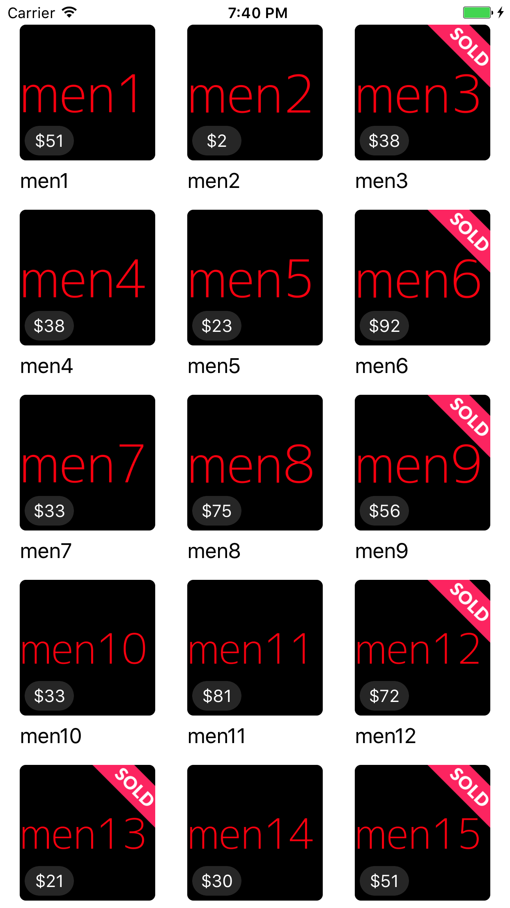

# mercari-ios-test
For Technical interview

## Description

- Build an app that loads data from `all.json` which is stored in main bundle, and make the app look like the above screenshot.
- Write in a such way that data retrieval implementation can be easily replaced. For example, it is currenly loaded from all.json file but in the near future we might want to fetch the data from network.
- In the collection cell view, it needs to display item image from photo, title from name, and price from price.
- You are encouraged to use Swift.
- You are encouraged to use ReactiveSwift.
display sold.png as shown when Item.status equals to sold_out.
- Even though this app is relatively simple, please write code in "production ready" level; that is, write in a way that you would normally do on production app.
- Basic unit tests for bonus points
- Please use a known architecture with justification for your choice included
- When you have questions, please don't hesitate to ask!

Estimated time commitment: 2 hours
